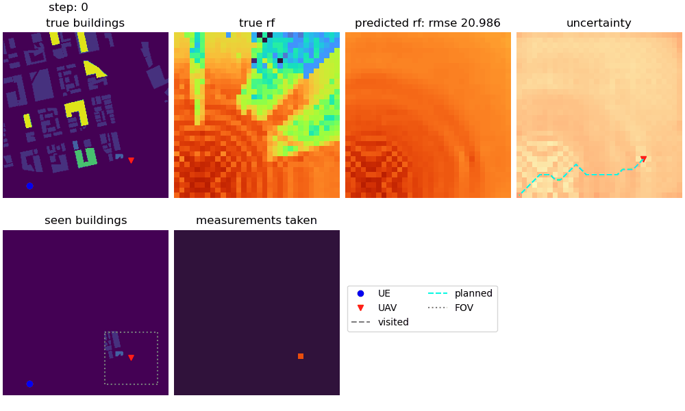

# OREMAN
Online Radio Environment Mapping for Aerial Networks

Models and Data for the paper "Online Radio Environment Map Creation via UAV Vision for Aerial Networks" to appear at IEEE Infocom 2024.

Coming soon...

